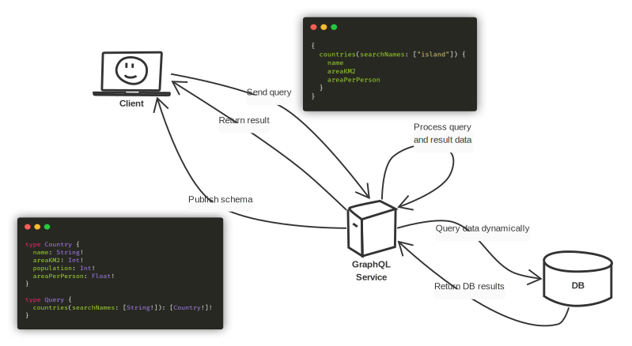
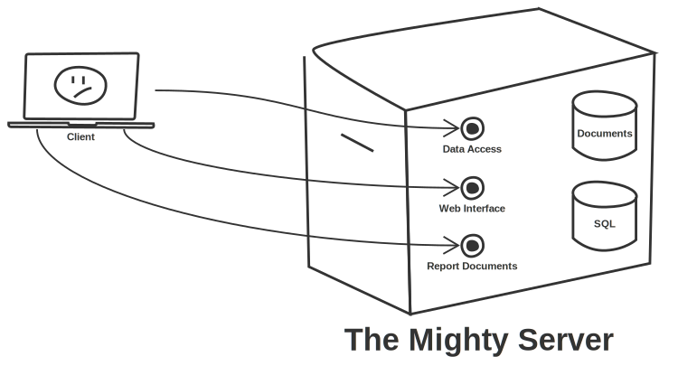
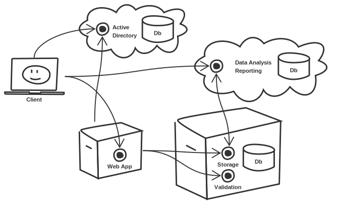
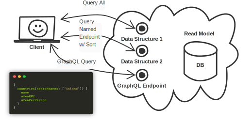
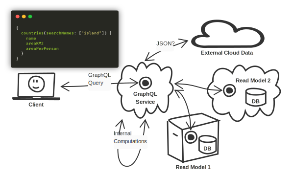

title: GraphQL and Microservices
subtitle: Integration Strategies
class: animation-fade
layout: true

<!-- This slide will serve as the base layout for all your slides -->

.bottom-bar[
{{title}}
]

---

class: impact

# {{title}}

## {{subtitle}}

.title-oli[
Oliver Sturm &bull; @olivers[@fosstodon.org] &bull; oliver@oliversturm.com
]

.title-logo[]

---

## Oliver Sturm

- Training Director at DevExpress
- Consultant, trainer, author, software architect and developer for over 25 years

- Contact: oliver@oliversturm.com

---

## Agenda

- Leveling the playing field -- what's GraphQL anyway?
- The difficulty of interating with service architectures
- Solution proposals

---

## GraphQL

.svg-light[]

---

class: impact

# DEMO

---

## Basic Service Structure

.svg-light[]

---

## Microservices Structure

.svg-light[]

---

## CQRS/ES Structure

.svg-light[]

---

## GraphQL Integration In Service Architectures

There are two integration options.

`1.` Provide an extra read model endpoint that understands GraphQL queries

--

> Of course it is possible to create a special read model for this purpose, instead of using an existing one

--

`2.` Create an accumulation service for dynamic GraphQL queries

---

## GraphQL Endpoint In The Read Model

.svg-light[]

---

class: impact

# DEMO

---

## Proxy/Facade/Mash GraphQL Service

.svg-light[]

---

class: impact

# DEMO

---

## Sources

- This presentation:

  - https://oliversturm.github.io/graphql-and-microservices
  - PDF download:  https://oliversturm.github.io/graphql-and-microservices/slides.pdf

- Source code: https://github.com/oliversturm/graphql-and-microservices

---

class: impact

# Thank You

Please feel free to contact me about the content anytime.

.title-oli[
Oliver Sturm &bull; @olivers[@fosstodon.org] &bull; oliver@oliversturm.com
]

.title-logo[

]
